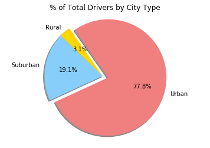

# Data Analysis with Python Pandas, Numpy, Matplotlib, and Seaborn
The premise of this project was to utilize Python Pandas, Numpy, Matplotlib, and Seaborn in a real world situation or scenario.  In this project, I was tasked with creating a Python script (specifically using Pandas and Numpy) in order to analyze a rideshare company's records of rides.  The records include information about active drivers, driver count, cities the drivers are located, city type (rural, urban, suburban), and individual fares.  After making calculations on the records, I created data visual representations in the form a bubble plot and pie charts (with the help of Seaborn and Matplotlib) in order to showcase relationships uncovered during the data analysis/calculation process.


# Pyber Share Riding


```python
# Import Dependencies
import pandas as pd
import numpy as np
import matplotlib.pyplot as plt
import seaborn as sns
```


```python
# Read and Merge CSVs
city_csvpath = "raw_data/city_data.csv"
ride_csvpath = "raw_data/ride_data.csv"
city_data = pd.read_csv(city_csvpath)
ride_data = pd.read_csv(ride_csvpath)
pyber_data = pd.merge(city_data, ride_data, how="right", on=["city", "city"])
pyber_data = pyber_data[["city", "date", "fare", "ride_id", "driver_count", "type"]]
pyber_data.head()
```


<div>
<style>
    .dataframe thead tr:only-child th {
        text-align: right;
    }

    .dataframe thead th {
        text-align: left;
    }

    .dataframe tbody tr th {
        vertical-align: top;
    }
</style>
<table border="1" class="dataframe">
  <thead>
    <tr style="text-align: right;">
      <th></th>
      <th>city</th>
      <th>date</th>
      <th>fare</th>
      <th>ride_id</th>
      <th>driver_count</th>
      <th>type</th>
    </tr>
  </thead>
  <tbody>
    <tr>
      <th>0</th>
      <td>Kelseyland</td>
      <td>2016-08-19 04:27:52</td>
      <td>5.51</td>
      <td>6246006544795</td>
      <td>63</td>
      <td>Urban</td>
    </tr>
    <tr>
      <th>1</th>
      <td>Kelseyland</td>
      <td>2016-04-17 06:59:50</td>
      <td>5.54</td>
      <td>7466473222333</td>
      <td>63</td>
      <td>Urban</td>
    </tr>
    <tr>
      <th>2</th>
      <td>Kelseyland</td>
      <td>2016-05-04 15:06:07</td>
      <td>30.54</td>
      <td>2140501382736</td>
      <td>63</td>
      <td>Urban</td>
    </tr>
    <tr>
      <th>3</th>
      <td>Kelseyland</td>
      <td>2016-01-25 20:44:56</td>
      <td>12.08</td>
      <td>1896987891309</td>
      <td>63</td>
      <td>Urban</td>
    </tr>
    <tr>
      <th>4</th>
      <td>Kelseyland</td>
      <td>2016-08-09 18:19:47</td>
      <td>17.91</td>
      <td>8784212854829</td>
      <td>63</td>
      <td>Urban</td>
    </tr>
  </tbody>
</table>
</div>


## Bubble Plot of Ride Sharing Data


```python
# Create bubble chart that showcase relationships between average fare, total rides, and total drivers per city
# Calculate the average fare ($) per city
cities_avg_fare = pyber_data.groupby("city").mean()["fare"]
# Total number of rides per city
cities_total_rides = pyber_data.groupby("city").count()["ride_id"]
# Create Data Frame with total number of drivers per city and city type
# Do loc to get rid of duplicates 
cities_types = pyber_data.loc[:, ["city", "type", "driver_count"]]
cities_types = cities_types.drop_duplicates()
# Create new Data Frame and set index to city
cities_df = cities_types.set_index("city")
# Add average fares and total rides to cities_df
cities_df["Average Fare"] = cities_avg_fare
cities_df["Total Rides"] = cities_total_rides
# Rename type and driver_count columns to City Type and Driver Count
cities_df = cities_df.rename(columns={"type": "City Type", "driver_count": "Total Drivers"})
# Reorder columns
cities_df = cities_df[["Average Fare", "Total Rides", "Total Drivers", "City Type"]]
cities_df.head()


# Create bubble plot
with sns.axes_style("darkgrid"):
    sns.lmplot(data=cities_df, x="Total Rides", y="Average Fare", fit_reg=False, hue="City Type", 
               palette=("lightcoral", "lightskyblue", "gold"), legend_out=False, size=6.5)
# Axes    
x_axis = cities_df["Total Rides"]
y_axis = cities_df["Average Fare"]
z_axis = cities_df["Total Drivers"]
colors = ["gold", "lightskyblue", "lightcoral"]
# Plot configurations
plt.title("Pyber Ride Sharing Data (2016)")
plt.xlabel("Total Number of Rides (Per City)")
plt.ylabel("Average Fare($)")
plt.xlim(-5, 70)
plt.ylim(15, 51)
plt.grid(True)
# Plot
plt.scatter(x_axis, y_axis, s=z_axis*17, alpha=0.7, c=colors, linewidth=1.1, edgecolor="black")
plt.show()
```


## % Total Fares by City Type


```python
# Do group by city type
group_city_type = pyber_data.groupby("type").sum()
# Calculate the sum of all fares
total_fare = group_city_type["fare"].sum()
# Find sum of rural fare with loc
rural_fare = group_city_type.loc["Rural", "fare"]
# Divide rural fare by total fare to get percentage
rural_fare_percent = rural_fare / total_fare
# Find sum of suburb fare with loc
suburb_fare = group_city_type.loc["Suburban", "fare"]
# Divide suburb fare by total fare to get percentage
suburb_fare_percent = suburb_fare / total_fare
# Find sum of urban fare with loc
urban_fare = group_city_type.loc["Urban", "fare"]
# Divide urban fare by total fare
urban_fare_percent = urban_fare / total_fare
# Create lists for pie chart
city_types = ["Rural", "Suburban", "Urban"]
fare_percent = [rural_fare_percent, suburb_fare_percent, urban_fare_percent]
colors = ["gold", "lightskyblue", "lightcoral"]
explode= (0, 0, 0.1)
# Plot pie chart
plt.pie(fare_percent, explode=explode, labels=city_types, colors=colors,
        autopct="%1.1f%%", shadow=True, startangle=125)
plt.axis("equal")
plt.title("% of Total Fares by City Type")
plt.show()
```


## % Total Rides by City Type


```python
# Create a pie chart for % of total rides by city type
# Do group by city type
rides_city_type = pyber_data.groupby(["type"]).count()
# Calculate total rides
total_rides = rides_city_type["ride_id"].sum()
# Find rural total rides with loc
rural_rides = rides_city_type.loc["Rural", "ride_id"]
# Divide rural total rides by total rides to get percentage
rural_rides_percent = rural_rides / total_rides
# Find suburb total ride with loc
suburb_rides = rides_city_type.loc["Suburban", "ride_id"]
# Divide suburb total rides with total rides to get percentage
suburb_rides_percent = suburb_rides / total_rides
# Find urban total rides
urban_rides = rides_city_type.loc["Urban", "ride_id"]
# Divide urban total rides with total rides to get percentage
urban_rides_percent = urban_rides / total_rides
# Create lists for pie chart
city_types = ["Rural", "Suburban", "Urban"]
rides_percent = [rural_rides_percent, suburb_rides_percent, urban_rides_percent]
colors = ["gold", "lightskyblue", "lightcoral"]
explode= (0, 0, 0.1)
#Plot pie chart
plt.pie(rides_percent, explode=explode, labels=city_types, colors=colors,
        autopct="%1.1f%%", shadow=True, startangle=125)
plt.axis("equal")
plt.title("% of Total Rides by City Type")
plt.show()
```


## % Total Drivers by City Type


```python
# Create a pie chart for % of total drivers by city type
# Use cities_types data frame and do group by city type and calculate sum of driver by each city type
total_drivers_type = cities_types.groupby("type").sum()
# Calculate total drivers
total_drivers = total_drivers_type.sum()["driver_count"]
# Calculate total rural drivers
rural_drivers= total_drivers_type.loc["Rural", "driver_count"]
# Divide rural total drivers by total drivers to get percentage
rural_drivers_percent = rural_drivers / total_drivers
# Calculate total suburb drivers
suburb_drivers = total_drivers_type.loc["Suburban", "driver_count"]
# Divide suburb total drivers by total drivers to get percentage
suburb_drivers_percent = suburb_drivers / total_drivers
# Calculate total urban drivers
urban_drivers = total_drivers_type.loc["Urban", "driver_count"]
# Divide urban total drivers by total drivers to get percentage
urban_drivers_percent = urban_drivers / total_drivers
# Create lists for pie chart
city_types = ["Rural", "Suburban", "Urban"]
drivers_percent = [rural_drivers_percent, suburb_drivers_percent, urban_drivers_percent]
colors = ["gold", "lightskyblue", "lightcoral"]
explode= (0, 0, 0.1)
# Plot pie chart
plt.pie(drivers_percent, explode=explode, labels=city_types, colors=colors,
        autopct="%1.1f%%", shadow=True, startangle=125)
plt.axis("equal")
plt.title("% of Total Drivers by City Type")
plt.show()
```




